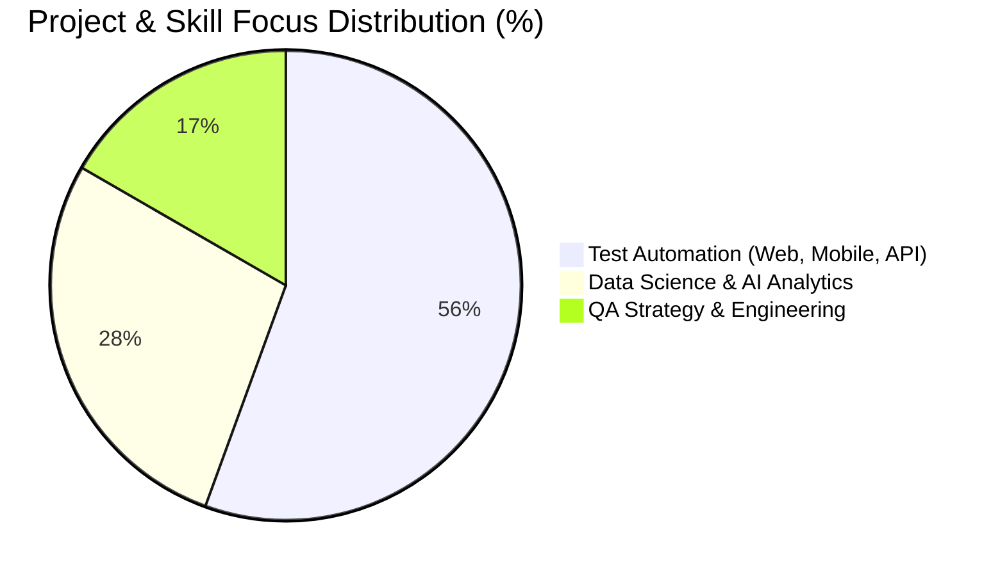

<div align="center">
  <h1>👋 Hi, I'm Shawon Barua</h1>
  <p><strong>Sr. QA Automation Engineer & SDET • 12+ Years Experience • Tokyo, Japan / Global</strong></p>
  
  <p>
    <a href="https://shawon-barua.github.io/Portfolio/"></a>
    <a href="https://linkedin.com/in/shawon-barua"></a>
    <a href="mailto:shawon.cse.ku@gmail.com"></a>
    <a href="https://shawon-barua.github.io/Portfolio/shawon_resume.pdf"></a>
  </p>
</div>

---

### 🚀 Quick Snapshot

- 🏢 **Experience:** Delivered enterprise QA & test automation at **Apple** *(Siri Modules)*, **Accenture**, **Rakuten Group**, **UPAY Fintech**, **Infolytx**, and **Samsung R&D**.
- 🎓 **Education:** M.Sc. in Applied Statistics & Data Science (*JU*) • B.Sc. in CSE (*Khulna University*).
- 🏆 **Recognitions:** *Top Bug Finder Award* among 300+ engineers at Samsung R&D • *Harvard University N2C2 NLP Challenge* Showcase Contributor.
- 🧪 **Focus:** Web, Mobile & API Test Automation, Performance/Load Testing (JMeter/Gatling), and Agentic AI-driven QA testing.

---

### 🛠️ Core Tech Stack

```text
• Test Automation : Playwright, Cypress, Selenium WebDriver, Appium (iOS & Android), REST Assured, Postman
• Performance & QA: Apache JMeter, Gatling, OWASP ZAP, Cucumber BDD, TestNG, JUnit
• Languages       : Java, JavaScript, TypeScript, Python, Swift, SQL, R
• DevOps & Cloud  : GitHub Actions, Jenkins, Docker, Kubernetes, AWS, GCP
```

---

### 📊 Project & Expertise Breakdown



---

<div align="center">
  📫 <strong>Let's Collaborate:</strong> <a href="mailto:shawon.cse.ku@gmail.com">shawon.cse.ku@gmail.com</a> | <a href="https://www.linkedin.com/in/shawon-barua/">linkedin.com/in/shawon-barua</a> | <a href="https://shawon-barua.github.io/Portfolio/">shawon-barua.github.io/Portfolio</a>
</div>
